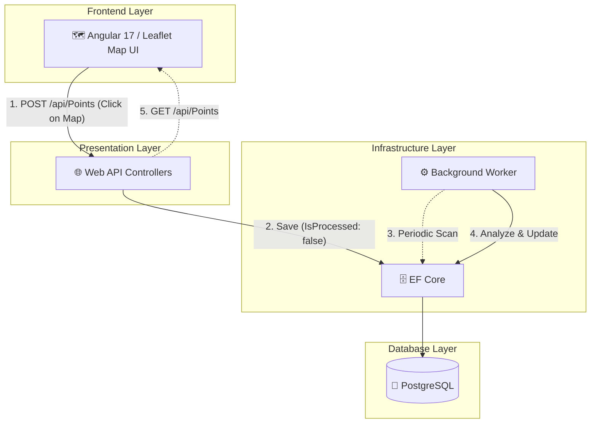

# GeoTracker & Analytics Hub 🌍

A modern, scalable Full-Stack Web Application built with **.NET 8** (Clean Architecture) and **Angular 17**. This project is designed to handle Geographic Information Systems (GIS) data, specifically focusing on collecting, storing, visualizing, and asynchronously processing spatial data (Points of Interest).

## 🚀 Key Features

* **Clean Architecture (Onion Architecture):** Strict separation of concerns across Domain, Application, Infrastructure, and Presentation layers.
* **Modern Frontend (Angular 17):** Built using the latest Standalone Components architecture, offering a lightweight and modular user interface.
* **Open-Source Map Integration:** Utilizes **Leaflet.js** for high-performance, interactive maps without the dependency or cost of Google Maps API keys.
* **Asynchronous Processing:** Utilizes a highly optimized Background Worker Service (`IHostedService`) to process spatial data without blocking the main API threads.
* **PostgreSQL & Entity Framework Core:** Robust data persistence with Code-First approach and fully configured migrations.
* **Dependency Injection Mastery:** Proper handling of Scoped services (`DbContext`) within Singleton background tasks using `IServiceScopeFactory`.
* **Containerized:** Fully ready for deployment with a multi-stage Dockerfile.
* **Unit Testing:** Implemented xUnit and In-Memory database for reliable, lightning-fast component testing following the AAA principle.

## 🛠️ Technology Stack

* **Frontend:** Angular 17 (Standalone), TypeScript, SCSS, Leaflet.js
* **Backend Framework:** .NET 8 Web API
* **Language:** C# 12
* **Architecture:** Clean Architecture / N-Tier
* **Database:** PostgreSQL
* **ORM:** Entity Framework Core 8
* **DevOps:** Docker
* **Testing:** xUnit, Moq, EF Core InMemory

## 📂 Project Structure

```text
GeoTrackerAnalyticsHub/
├── src/                                   # BACKEND (.NET 8)
│   ├── Core/
│   │   ├── GeoTracker.Domain              # Core Entities (PointOfInterest)
│   │   └── GeoTracker.Application         # Interfaces and Business Logic
│   ├── Infrastructure/
│   │   ├── GeoTracker.Persistence         # EF Core DbContext and PostgreSQL Configs
│   │   └── GeoTracker.Workers             # Background Services for raw GIS data
│   └── Presentation/
│       └── GeoTracker.WebAPI              # API Controllers and Middleware
│
└── client/                                # FRONTEND (Angular 17)
    ├── src/app/
    │   ├── app.component.ts               # Main Map Component & Leaflet Integration
    │   └── app.config.ts                  # HTTP Client & Routing Providers
    └── angular.json                       # Angular workspace configurations
```

## 🏗️ System Architecture Flow



## ⚙️ Getting Started

### Prerequisites

*  .NET 8 SDK

*  Node.js (v18+) & Angular CLI (v17+)

*  PostgreSQL

*  Docker (Optional)

### 1. Running the Backend Locally

Clone the repository.

Update the `DefaultConnection` string in:

```text
src/Presentation/GeoTracker.WebAPI/appsettings.json
```

with your PostgreSQL credentials.

Apply database migrations:

```bash
dotnet ef database update --project src/Infrastructure/GeoTracker.Persistence --startup-project src/Presentation/GeoTracker.WebAPI
```

Run the application:

```bash
dotnet run --project src/Presentation/GeoTracker.WebAPI
```

Navigate to:

```text
http://localhost:<PORT>/swagger
```

to access the API documentation.

### 2. Running the Frontend Locally

Open a new terminal and navigate to the frontend directory:

```bash
cd client
```

Install the necessary dependencies:

```bash
npm install
```

Start the Angular development server:

```bash
ng serve
```

Open your browser and navigate to:

```text
http://localhost:4200
```

to view the interactive map.

## Running with Docker (Backend)

```bash
docker build -t geotracker-api .
docker run -d -p 8080:8080 geotracker-api
```

````</PORT>