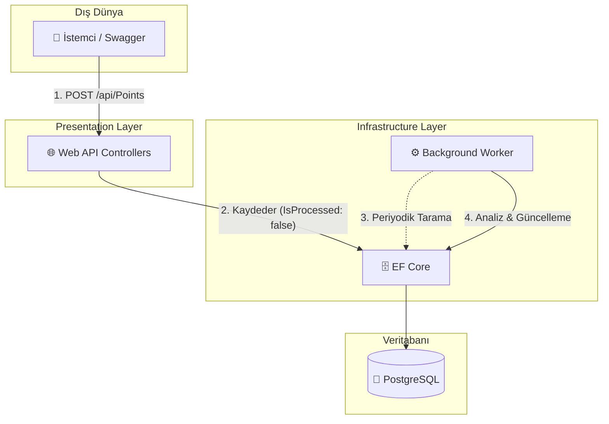

# GeoTracker & Analytics Hub 🌍

A modern, scalable Web API built with **.NET 8** and **Clean Architecture** principles. This project is designed to handle Geographic Information Systems (GIS) data, specifically focusing on collecting, storing, and asynchronously processing spatial data (Points of Interest).

## 🚀 Key Features
*   **Clean Architecture (Onion Architecture):** Strict separation of concerns across Domain, Application, Infrastructure, and Presentation layers.
*   **Asynchronous Processing:** Utilizes a highly optimized Background Worker Service (`IHostedService`) to process spatial data without blocking the main API threads.
*   **PostgreSQL & Entity Framework Core:** Robust data persistence with Code-First approach and fully configured migrations.
*   **Dependency Injection Mastery:** Proper handling of Scoped services (`DbContext`) within Singleton background tasks using `IServiceScopeFactory`.
*   **Containerized:** Fully ready for deployment with a multi-stage Dockerfile.

## 🛠️ Technology Stack
*   **Framework:** .NET 8 Web API
*   **Language:** C# 12
*   **Architecture:** Clean Architecture / N-Tier
*   **Database:** PostgreSQL
*   **ORM:** Entity Framework Core 8
*   **DevOps:** Docker

## 📂 Project Structure
```text
src/
├── Core/
│   ├── GeoTracker.Domain      # Core Entities (PointOfInterest) - No external dependencies
│   └── GeoTracker.Application # Interfaces and Business Logic
├── Infrastructure/
│   ├── GeoTracker.Persistence # EF Core DbContext and PostgreSQL Configurations
│   └── GeoTracker.Workers     # Background Services for processing raw GIS data
└── Presentation/
    └── GeoTracker.WebAPI      # API Controllers and Middleware (Entry Point)
```

## 🏗️ System Architecture Flow



## ⚙️ Getting Started

### Prerequisites
*   .NET 8 SDK
*   PostgreSQL
*   Docker (Optional)

### Running Locally
1. Clone the repository.
2. Update the `DefaultConnection` string in `src/Presentation/GeoTracker.WebAPI/appsettings.json` with your PostgreSQL credentials.
3. Apply database migrations:
   ```bash
   dotnet ef database update --project src/Infrastructure/GeoTracker.Persistence --startup-project src/Presentation/GeoTracker.WebAPI
   ```
4. Run the application:
   ```bash
   dotnet run --project src/Presentation/GeoTracker.WebAPI
   
```
5. Navigate to `http://localhost:<PORT>/swagger` to access the API documentation and test endpoints.

### Running with Docker
```bash
docker build -t geotracker-api .
docker run -d -p 8080:8080 geotracker-api
```
