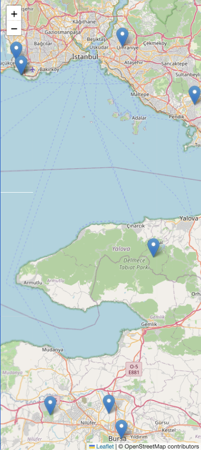
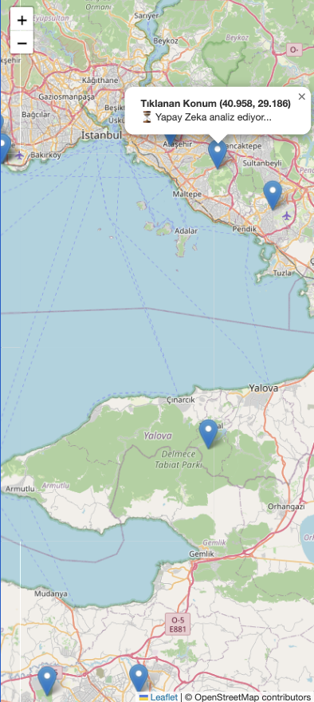
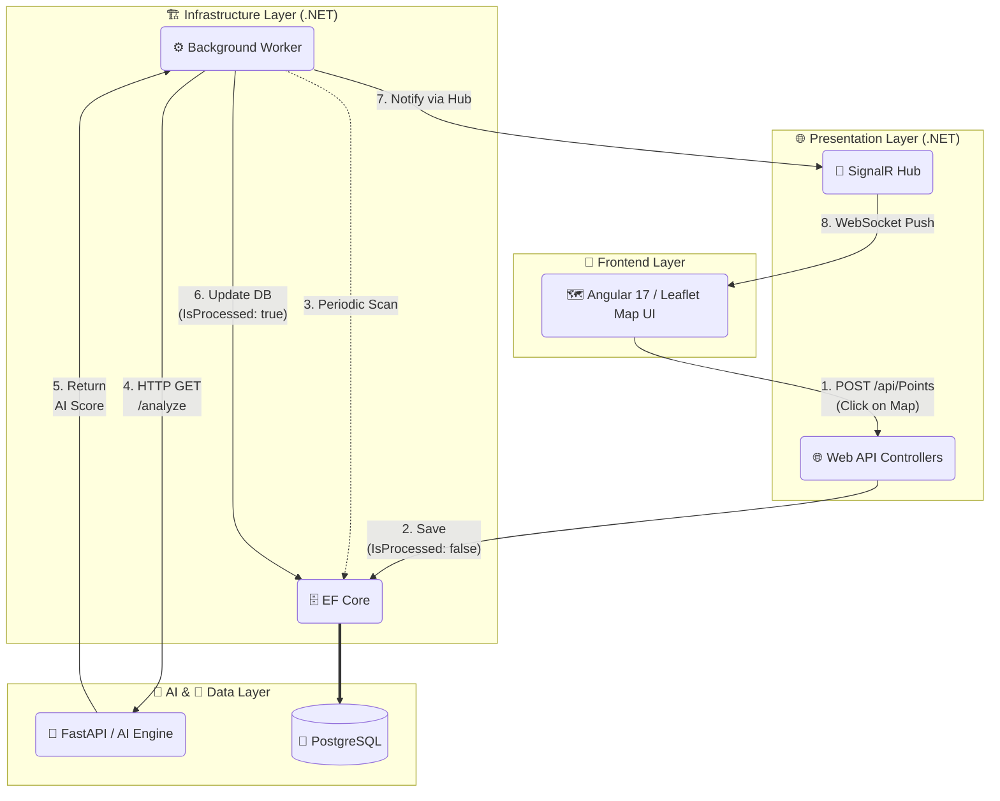

# GeoTracker & Analytics Hub 🌍

A modern, scalable **Polyglot Microservices** Web Application built with **.NET 8** (Clean Architecture), **Python FastAPI**, and **Angular 17**. This project is designed to handle Geographic Information Systems (GIS) data, specifically focusing on collecting, storing, visualizing, real-time processing via SignalR, and AI-driven spatial analysis.

## 📸 App Screenshots

<p align="center">
  
  &nbsp;
  
</p>

## 🚀 Key Features

* **Clean Architecture (Onion Architecture):** Strict separation of concerns across Domain, Application, Infrastructure, and Presentation layers.
* **Polyglot Microservices:** Distributed backend utilizing **.NET 8** for core business logic/data persistence and **Python FastAPI** for specialized AI/LLM spatial analysis.
* **Real-Time Data Visualization:** Integrated **SignalR (WebSockets)** pushes asynchronous processing results from the .NET Worker directly to the Angular UI without page reloads.
* **Modern Frontend (Angular 17):** Built using the latest Standalone Components architecture, offering a lightweight and modular user interface.
* **Open-Source Map Integration:** Utilizes **Leaflet.js** for high-performance, interactive maps without the dependency or cost of Google Maps API keys.
* **Asynchronous Processing:** Utilizes a highly optimized Background Worker Service (`IHostedService`) to process spatial data and communicate with the Python AI service without blocking the main API threads.
* **PostgreSQL & Entity Framework Core:** Robust data persistence with Code-First approach and fully configured migrations.
* **Dependency Injection Mastery:** Proper handling of Scoped services (`DbContext`) within Singleton background tasks using `IServiceScopeFactory`.
* **Containerized:** Fully ready for deployment with a multi-stage Dockerfile.
* **Unit Testing:** Implemented xUnit and In-Memory database for reliable, lightning-fast component testing following the AAA principle.

## 🛠️ Technology Stack

* **Frontend:** Angular 17 (Standalone), TypeScript, SCSS, Leaflet.js
* **Backend (Core):** .NET 8 Web API, SignalR Hubs
* **Microservice (AI):** Python 3.12, FastAPI, Uvicorn
* **Language:** C# 12, Python 3
* **Architecture:** Clean Architecture / Microservices / Polyglot
* **Database:** PostgreSQL
* **ORM:** Entity Framework Core 8
* **DevOps:** Docker
* **Testing:** xUnit, Moq, EF Core InMemory

## 📂 Project Structure

```text
GeoTrackerAnalyticsHub/
├── src/                                   # BACKEND (.NET 8)
│   ├── Core/
│   │   ├── GeoTracker.Domain              # Entities (PointOfInterest with AI fields)
│   │   └── GeoTracker.Application         # Interfaces (IMapNotificationService)
│   ├── Infrastructure/
│   │   ├── GeoTracker.Persistence         # EF Core DbContext & Migrations
│   │   └── GeoTracker.Workers             # Background Worker (HttpClient & AI logic)
│   └── Presentation/
│       └── GeoTracker.WebAPI              # Controllers, SignalR Hubs & Services
│
├── ai_service/                            # AI MICROSERVICE (Python)
│   ├── main.py                            # FastAPI AI Analysis Logic
│   └── venv/                              # Python Virtual Environment
│
└── client/                                # FRONTEND (Angular 17)
    ├── src/app/
    │   └── app.component.ts               # Map UI & SignalR Listener
    └── angular.json
```

## 🏗️ System Architecture Flow



## ⚙️ Getting Started

### Prerequisites

* .NET 8 SDK
* Node.js (v18+) & Angular CLI (v17+)
* Python (3.10+)
* PostgreSQL
* Docker (Optional)

### 1. Running the AI Microservice (Python)

Open a terminal and navigate to the `ai_service` directory:

```bash
cd ai_service
python3 -m venv venv
source venv/bin/activate  # On Windows: venv\Scripts\activate
pip install fastapi uvicorn
uvicorn main:app --reload --port 8000
```

### 2. Running the Backend (.NET) Locally

Open a new terminal and clone the repository if you haven't already.

Update the `DefaultConnection` string in:

```text
src/Presentation/GeoTracker.WebAPI/appsettings.json
```

with your PostgreSQL credentials.

Apply database migrations:

```bash
dotnet ef database update --project src/Infrastructure/GeoTracker.Persistence --startup-project src/Presentation/GeoTracker.WebAPI
```

Run the application:

```bash
dotnet run --project src/Presentation/GeoTracker.WebAPI
```

Navigate to:

```text
http://localhost:5184/swagger
```

to access the API documentation.

### 3. Running the Frontend Locally

Open a new terminal and navigate to the frontend directory:

```bash
cd client
```

Install the necessary dependencies:

```bash
npm install
```

Start the Angular development server:

```bash
ng serve
```

Open your browser and navigate to:

```text
http://localhost:4200
```

to view the interactive map and test the real-time AI processing architecture.

## 🐳 Running with Docker (Backend)

```bash
docker build -t geotracker-api .
docker run -d -p 8080:8080 geotracker-api
```